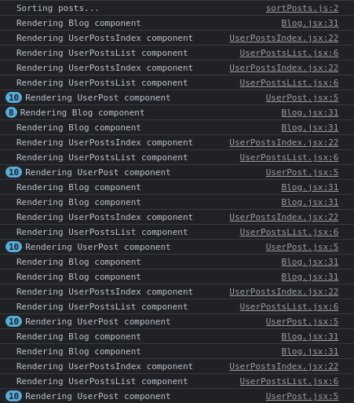
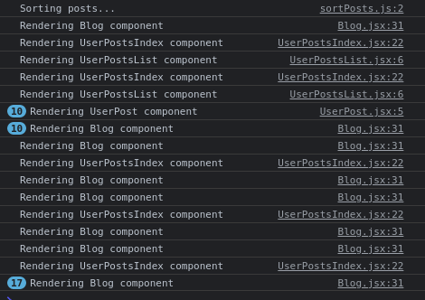

# Memoization in React - How `useCallback()` Works

## Introduction
This post is about how to use the `useCallback()` hook in React. This is the third part on the series titled [Memoization in React]().

In this post, we dive into the details of the `useCallback()` hook with an extension of the example demonstrated in the previous post titled [Memoization in React - How `useCallback()` Works](). The code is already available in [this GitHub repository](https://github.com/anewman15/react-memoization).

As done in the previous two articles, we will make use of **_commenting out_** and **_uncommenting_** in order to make the changes to the code and utilize the browser's console to see the impact of the changes. I'm using Google Chrome and recommend it for all.

## Project Setup
We will take off from where we left off in the previous post. In order to get everything up and running, please follow these steps:

1. Clone the `react-memoization` project from [this repo](https://github.com/anewman15/react-memoization) to a folder of your choice.
2. Navigate to the cloned folder and open it in your code editor.
3. Run `yarn install` to install all npm packages.
4. Run `yarn start` to start the server.
5. Open Google Chrome and navigate to `http://localhost:3000`.
6. Use `Ctrl + Shift + J` on Ubuntu or `Command + Option + J` on Mac to inspect the webpage and open browser's console.

### Project Content Overview
If you look at the project folder, you'll find out that `react-memoization` is created using `create-react-app`.

The app is based on the idea of a list of posts on a blog. There are several components involving a user to see the latest posts and a list of the user's posts. Allow yourself some time to understand the components individually, their relationships, their state changes and how props are passed through. It is crucial to pay close attention to how change of a parent's state triggers re-render of its descendents.

The discussion of this article is focused on optimizing performance by memoizing callback functions that are passed as a prop from a parent component to a child. We are going to use the `useCallback()` hook for this.

## Pass Callback from Parent to Child
In this example, we'll consider the `<UserPostsIndex />`, `<UserPostsList />` and `<UserPosts />` components. As you can see below, `<UserPostsIndex />` fetches and sets `userPosts` when the compnent renders:

```JavaScript
import React, { useCallback, useEffect, useState } from "react";
import fetchUserPosts from "../fetch/fetchUserPosts";
import UserPostsList from "./UserPostsList";

const UserPostsIndex = ({ signedIn }) => {
  const [userPosts, setUserPosts] = useState([]);

  const deletePost = e => {
  // const deletePost = useCallback(e => {
    const { postId } = e.currentTarget.dataset;
    const remainingPosts = userPosts.filter(post => post.id !== parseInt(postId));
    setUserPosts(remainingPosts);
  };
  // }, [userPosts]);

  useEffect(() => {
    const posts = fetchUserPosts();
    setUserPosts(posts);
  }, []);

  // console.log(userPosts)
  // console.log('Rendering UserPostsIndex component');

  return (
    <div className="my-1 p-2 box">
      <div className="m-1 py-1">
        <h2 className="heading-md">Your Posts</h2>
        <p className="m-1 p-1">{signedIn ? `Signed in`: `Signed out `}</p>
        {
          userPosts &&
          (
            <div className="px-1">
              {
                <UserPostsList userPosts={userPosts}
                  deletePost={deletePost}
                />
              }
            </div>
          )
        }
      </div>
    </div>
  );
};

export default React.memo(UserPostsIndex);
```

In the JSX, we have a `deletePost()` function passed on to `<UserPostsList />` component, along with `userPosts`. Prior to that, `<UserPostsIndex>` receives `signedIn` as a prop from `<Blog />`.

In the `<UserPostsList />` component, we receive `userPosts` and `deletePost()` function and display a `<UserPost />` for each post in `userPosts` array:

```JavaScript
import React from 'react';
import UserPost from './UserPost';

const UserPostsList = ({ userPosts, deletePost }) => {

  console.log('Rendering UserPostsList component');

  return (
    (
      <div className="px-1">
        {
          userPosts.map(post => (
            <div key={post.id} className="my-1 box flex-row">
              <UserPost post={post} />
              <button className="btn btn-danger" data-post-id={post.id} onClick={deletePost}>Delete</button>
            </div>
        ))
        }
      </div>
    )
  );
};

export default React.memo(UserPostsList);
```

Inside `<UserPostsList />`, `deletePost()` is used to remove an item from the list.

`<UserPost />` is just a presentational component where we display the title as a link. Feel free to go over it in your editor.

Now let's uncomment ` // console.log('Rendering UserPostsIndex component');` in `<UserPostsIndex />`

```JavaScript
console.log('Rendering UserPostsIndex component');
```

and `// console.log('Rendering UserPostsList component');` in `<UserPostsList />`:

```JavaScript
console.log('Rendering UserPostsList component');
```

If we check our console, we can see the logs for inital rendering of the components. Then if we click the `SignOut` button on the navbar, we see batches of renders from `<UserPostsIndex />`, `<UserPostsList />` and `<UserPost />`:



We can account for the re-render of `<UserPostsIndex />` because the value of the `signedIn` prop changed. However, re-rendering `<UserPostsList />` does not make sense because `userPosts` does not change with the change in the value of `signedIn`. We already memoized `<UserPostsList />` with `React.memo()`. We don't see any reason why it should re-render due changes in any ancestor's state. Does `deletePost()` change ?

## Referential Integrity
Well, `deletePost()` changes, and it changes due to breaking of **referential integrity**. And this change triggers a re-render in `<UserPostsList />` which we don't expect to see.

In React, a function passed to a component as a prop fails to maintain referential integrity, because a new function object is created at every render from a function declared inside a parent component. So the value of the prop in the receiver component is different at every re-render of the parent. As a result the receiver also re-renders, unexpectedly.

In our example, `<UserPostsList />` is not expected to be re-rendered, but it does because referential integrity fails as `deletePost()` is a different function object at every re-render of `<UserPostsIndex />`, i.e. they are not equal. So, when we change `signedIn`, `<UserPostsIndex />` re-renders, and so `<UserPostsList />` also re-renders.

## Memoizing Event Listeners with `useCallback()`
Now, memoizing `deletePost()` produces the same function at every re-render. Let's memoize it with `useCallback()` by making the following changes in `<UserPostsIndex />`:

```JavaScript
//  const deletePost = e => {
  const deletePost = useCallback(e => {
    const { postId } = e.currentTarget.dataset;
    const remainingPosts = userPosts.filter(post => post.id !== parseInt(postId));
    setUserPosts(remainingPosts);
  // };
  }, [userPosts]);
```

Now, if we click the `Sign Out` button a few times, we'll see in the console that `<UserPostsIndex />` is re-rendered, but `<UserPostsList />` and `<UserPost />` is not:



This is because `useCallback()` caches and produces the same copy of `deletePost()` at every render of `<UserPostsList />`, until its dependencies change. Here, a change in `userPosts` triggers a renewal of the memo of the function, so everytime the value of `userPosts` changes, `<UserPostsList />` will be re-rendered.

## Other Cases
Memoized callbacks are very important to maintain referential integrity so that the same function object is made available every time a component re-renders. `useCallback()` is also used to cache callbacks in debouncing, as well as dependencies in hooks like `useEffect()`.

## Summary

In this article, we looked at how re-renders of a parent component leads to violation of referential integrity of callback functions passed in as props to child components, which causes unnecessary re-renders of a child. `useCallback()` helps us produce the same function object at every re-render of the parent, and be pass it to the child. This prevents the unnecessary re-renders of child components.