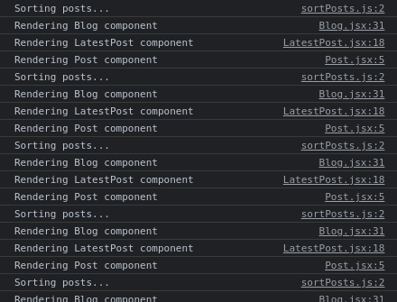
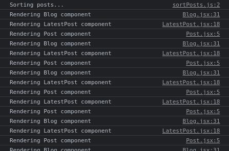
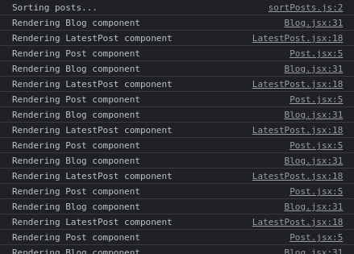

# Memoization in React - How `useMemo()` Works

## Introduction
This post is about how to use the `useMemo()` hook in React. This is the second part on the series titled [Memoization in React]().

In this post, we dive into the details of the `useMemo()` hook with an extension of the example demonstrated in the previous post titled [Memoization in React](). The code is already available in [this GitHub repository](https://github.com/anewman15/react-memoization).

As done in the previous article, we will make use of **_commenting out_** and **_uncommenting_** in order to make the changes to the code and utilize the browser's console to see the impact of the changes. I'm using Google Chrome and recommend it for all.

## Project Setup
We take off from where we left off in the previous post. In order to get everything up and running, please follow these steps:

1. Clone the `react-memoization` project from [this repo](https://github.com/anewman15/react-memoization) to a folder of your choice.
2. Navigate to the cloned folder and open it in your code editor.
3. Run `yarn install` to install all npm packages.
4. Run `yarn start` to start the server.
5. Open Google Chrome and navigate to `http://localhost:3000`.
6. Use `Ctrl + Shift + J` on Ubuntu or `Command + Option + J` on Mac to inspect the webpage and open browser's console.

### Project Content Overview
If you look at the project folder, you'll find out that `react-memoization` is created using `create-react-app`.

The app is based on the idea of a list of posts on a blog. There are several components involving a user to see the latest posts and a list of the user's posts. Allow yourself some time to understand the components individually, their relationships, their state changes and how props are passed through. It is crucial to pay close attention to how change of a parent's state triggers re-render of its descendents.

The discussion of this article is focused on optimizing performance by memoizing the value of resource intensive functions, such as a sorting function. In React, we do this with the `useMemo()` hook.

## Resource Intensive Functions
We're going to jump back to the `<Blog />` component for this example:

```JavaScript
import React, { useEffect, useMemo, useState } from 'react';
import fetchUpdatedPosts from '../fetch/fetchUpdatedPosts';
import allPosts from './../data/allPosts.json';
import sortPosts from '../utils/sortPosts';
import LatestPost from './LatestPost';
import UserPostsIndex from './UserPostsIndex';

const Blog = ({ signedIn }) => {
  const [updatedPosts, setUpdatedPosts] = useState(allPosts);
  const [localTime, setLocalTime] = useState(new Date().toLocaleTimeString());

  const getLatestPosts = () => {
    const posts = fetchUpdatedPosts();
    setUpdatedPosts(posts);
  };

  // const sortedPosts = sortPosts(updatedPosts);
  const sortedPosts = useMemo(() => sortPosts(updatedPosts), [updatedPosts]);

  useEffect(
    () => {
      const id = setInterval(
        () => setLocalTime(new Date().toLocaleTimeString()),
        1000
      );
      return () => clearInterval(id);
    },
    []
  );

  console.log('Rendering Blog component');

  return (
    <div className="container">
      <h1 className="m-1 p-1 text-center heading-lg">Memoization in React</h1>
      <div className="m-1 p-2 ">
        <div className="my-1 p-2 box">
          <div className="latest-posts-top">
            <h3 className="heading-md my-1 p-1">Latest posts</h3>
            <div className="p-1">
              {localTime}
            </div>
          </div>
          <div className="my-1">
            <button className="btn btn-primary" onClick={getLatestPosts}>Get&nbsp;Latest&nbsp;Post</button>
          </div>
          <hr className="hr my-2" />
          <LatestPost signedIn={signedIn} post={sortedPosts[0]} />
        </div>
        <UserPostsIndex signedIn={signedIn}/>
      </div>
    </div>
  );
};

// export default Blog;
export default React.memo(Blog);
```

We'd like to focus particularly on the `sortPosts()` utility function which can get expensive if passed a long array of posts. At the moment, we are only sorting 101 items returned from `fetchUpdatedPosts()`, but in an actual application the number can be much higher and consume resources at cale. Thus it is an expensive function.

If we look inside the `useEffect()` hook, we are updating the locale time string and storing it in `localTime` for our clock. `localTime` updates every second and at each state change triggers a re-render of `<Blog />`. The clock does not represent a genuine UI feature for us here, but it is there to make a point about how frequent re-renders complicates things with expensive utility functions.

Our `sortPosts()` logs `Sorting posts...` to the console and returns a sorted array from the passed in array:

```JavaScript
const sortPosts = posts => {
  console.log('Sorting posts...');
  return posts.sort((a, b) => b.id - a.id);
};

export default sortPosts;
```

If we look at the console, we see that `Sorting posts...` is being looged at 1000ms intervals, i.e. with the tick of our clock:



This shows `sortPosts()` is called at every re-render of `<Blog />`. An expensive function, invoked every second for no obvious reason is too much of an ask from the app. We don't want `sortPosts()` to be called if `updatedPosts` is not changed.

## Enter `useMemo()`
`useMemo()` helps us memoize the value of `sortPosts()` when `updatedPosts` doesn't change. Let's use the memoized function:

```JavaScript
  // const sortedPosts = sortPosts(updatedPosts);
  const sortedPosts = useMemo(() => sortPosts(updatedPosts), [updatedPosts]);
```

Checking our console, we can see that `Sorting posts...` has been logged only once, indicating only one invocation of `sortPosts()`:



This gives us a huge performance gain.

**Dependencies**
Notice the dependency of `useMemo()` as the second argument, `updatedPosts`. We are asking the hook to renew the memo when `updatedPosts` changes. Let's try to change the value of `updatedPosts`:

In the JSX, we have a `Get Latest Post` button, which is used to fetch latest posts on demand. Every time `Get Latest Post` button is clicked, `updatedPosts` is updated with the invocation of `getLatestPosts()`. If the state of `updatedPosts` is changed, a re-render of `<Blog />` is triggered, which leads to a call to `sortPosts()` with the new value of `updatedPosts` passed in.

If we check our console while clicking the button, we can clearly see `Sorting posts...` being logged for each click:


It is important to notice that, if we remove the dependency from `useMemo()`, `sortPosts()` will not be invoked when `updatedPosts` change:

```JavaScript
  // const sortedPosts = sortPosts(updatedPosts);
  const sortedPosts = useMemo(() => sortPosts(updatedPosts), []);
```

There is no sorting going on when we need it:



It is also important to know that `useMemo()` returns a value, as opposed to a function. This is what differentiates it from the `useCallback()` hook, which returns a memoized function. So, `useMemo()` is preferred for memoizing a value, rather than a callback function.

## Summary

In this article, we looked into the use of `useMemo()` hook and found out the it play crucial role in optimizing performance of our app by memoizing a expensive utility function. We saw that it is important to specify the dependency of `useMemo()` so that the memo is renewed when the state of a dependency changes.

In the next post, we will demonstrate the use of `useCallback()` hook.