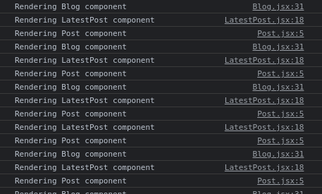
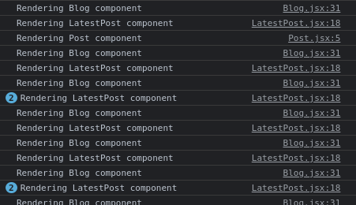
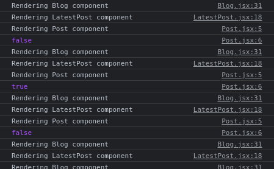
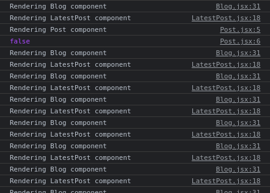

# Memoization in React

## Introduction
This is the first part of a series on the use of memoization in React. In this series, we'll cover memoizing a React component with `React.memo()` as well as caching functions and values with React's memoization hooks.

We will begin with a progressive example that involves memoizing a functional component, which will be gradually extended to include use cases for the hooks: `useCallback()` and `useMemo()`. `useCallback()` is leveraged for memoizing a callback function, whereas `useMemo()` is used to cache a computed value from an expensive function, for example, a sorting function that processes large amount of data.

In this post, we'll demonstrate the use of `React.memo()`, which is a **Higher Order Function** that adds caching logic to the passed in component. In the upcoming articles, we'll discuss about how to use `useCallback()` and `useMemo()`.

## What is Memoization ?
Memoization is an optimization technique that allows us to store the last computed value or object from a resource intensive function. It allows us to bypass the function's costly computations when the function is called with the same parameters repeatedly.

In React, memoization is used for optimizing performance of an app by preventing unnecessary renders of components participating in the component hierarchy, and by caching callbacks and values of expensive utility functions.

As React is all about rendering components in the virtual DOM prior to updating the actual Document Object Model in the browser, a lot of memory and time is wasted on useless renderings due to unaccounted for state updates. Using memoization in the right way helps in better use of computing resources in an app.

On the other hand, using it the wrong way can rip us off the benefits. Not only that, on the flip side of unnecessary re-renderings, unnecessary memoization can sometimes cost more than ignoring memoization - eventually hurting performance.

## Project Setup
This post is more of a demo than a coding tutorial, as I've made the code already available in this [GitHub repo](https://github.com/anewman15/react-memoization). All the components have been coded ahead of time and we'll use **_commenting out_** and **_uncommenting_** on the existing code to discuss different aspects of the above mentioned memoization methods.

We'll follow the impact of memoization mainly from the browser's console. I'll be using Google Chrome, and recommend it for the demonstration.

In order to get everything up and running, please follow these steps:

1. Clone the `react-memoization` project from [this repo](https://github.com/anewman15/react-memoization) to a folder of your choice.
2. Navigate to the cloned folder and open it in your code editor.
3. Run `yarn install` to install all npm packages.
4. Run `yarn start` to start the server.
5. Open Google Chrome and navigate to `http://localhost:3000`.
6. Use `Ctrl + Shift + J` on Ubuntu or `Command + Option + J` on Mac to inspect the webpage and open browser's console.

## Project Content Overview
If you look at the project folder, you'll find out that `react-memoization` is created using `create-react-app`.

The app is based on the idea of a list of posts on a blog. There are several components involving a user to see the latest posts and a list of the user's posts. Allow yourself some time to understand the components individually, their relationships, their state changes and how props are passed through. It is crucial to pay close attention to how change of a parent's state triggers re-render of its descendents.

Our main components for the entire series will be `<App />`, `<Blog/>`, `<LatestPost />`, `<Post />`, `<UserPostsIndex />`, `<UserPostsList />` and `<UserPosts />`.

The focus of this article will be the `<App />`, `<Blog />`, `<LatestPost />`, and `<Post />` components. Below, we'll delve into what memoizing the `<Post />` component with `React.memo()` does.

## Memoizing a Functional Component using `React.memo()`
To begin with, we have an `<App />` component that houses `Blog`. I'll skip it for brevity, but if you look `<App />`, you'll see we store a `signedIn` state with `useState()` hook. We also have a toggler function that alters the value of `signedIn`. We pass `signedIn` to `<Blog />`.

`<Blog />` contains a `<LatestPost />` component nested inside a tree of `div`s:

```JavaScript
import React, { useEffect, useMemo, useState } from 'react';
import fetchUpdatedPosts from '../fetch/fetchUpdatedPosts';
import allPosts from './../data/allPosts.json';
import sortPosts from '../utils/sortPosts';
import LatestPost from './LatestPost';
import UserPostsIndex from './UserPostsIndex';

const Blog = ({ signedIn }) => {
  const [updatedPosts, setUpdatedPosts] = useState(allPosts);
  const [localTime, setLocalTime] = useState(new Date().toLocaleTimeString());

  const getLatestPosts = () => {
    const posts = fetchUpdatedPosts();
    setUpdatedPosts(posts);
  };

  // const sortedPosts = sortPosts(updatedPosts);
  const sortedPosts = useMemo(() => sortPosts(updatedPosts), [updatedPosts]);

  useEffect(
    () => {
      const id = setInterval(
        () => setLocalTime(new Date().toLocaleTimeString()),
        1000
      );
      return () => clearInterval(id);
    },
    []
  );

  console.log('Rendering Blog component');

  return (
    <div className="container">
      <h1 className="m-1 p-1 text-center heading-lg">Memoization in React</h1>
      <div className="m-1 p-2 ">
        <div className="my-1 p-2 box">
          <div className="latest-posts-top">
            <h3 className="heading-md my-1 p-1">Latest posts</h3>
            <div className="p-1">
              {localTime}
            </div>
          </div>
          <div className="my-1">
            <button className="btn btn-primary" onClick={getLatestPosts}>Get&nbsp;Latest&nbsp;Post</button>
          </div>
          <hr className="hr my-2" />
          <LatestPost signedIn={signedIn} post={sortedPosts[0]} />
        </div>
        <UserPostsIndex signedIn={signedIn}/>
      </div>
    </div>
  );
};

export default React.memo(Blog);
```

`<Blog />` gets a list of posts in an `useEffect` hook, sorts the results and sets the `updatedPosts` state. The first items from the sorted array is then passed to `<LatestPost />` component along with `signedIn`.

`<LatestPost />` nests the `<Post />` component, which we are going to memoize with `React.memo()`. Let's zoom in on `<LatestPost />` to see what it does:

```JavaScript
import React, { useEffect, useState } from 'react';
import Post from './Post';

const LatestPost = ({ signedIn, post }) => {
  const [likesCount, setLikesCount] = useState(null);

  useEffect(
    () => {
      const id = setInterval(() =>{
        setLikesCount(likesCount => likesCount + 1)
      }, 3000);

      return () => clearInterval(id);
    },
    []
  );

  console.log('Rendering LatestPost component');

  return (
    <div className="my-2 mx-2 p-2 border border-rounded">
      {
        post ?
          (
            <>
              <Post signedIn={signedIn} post={post} />
              {
                likesCount && (
                  <div className="my-1 p-1">
                    <span>{likesCount}</span>&nbsp;<span>Likes</span>
                  </div>
                )
              }
            </>
          ) :
          <p>Click on Get Latest Post button</p>
      }
    </div>
  );
};

export default LatestPost;
```

We can see that `<LatestPost />` changes its local state of `likesCount` every 3 seconds in the `useEffect()` hook. Because of this, `<LatestPost />` should re-render every 3 seconds. So should `<Post />` as a consequence of being a child of `<LatestPost />`.

`<Post />` receives `signedIn` and `post` as props and displays the content of `post`:

```JavaScript
import React from 'react';

const Post = ({ signedIn, post }) => {

  console.log('Rendering Post component');
  // console.log(signedIn);

  return (
    <div className="">
      {
        post && (
        <div className="post p-1">
          <h1 className="heading-sm py-1">{post.title}</h1>
          <p>{post.body}</p>
        </div>
        )
      }
    </div>
  );
};

const customComparator = (prevProps, nextProps) => {
  return nextProps.post === prevProps.post;
};

export default Post;
// export default React.memo(Post);
// export default React.memo(Post, customComparator);
```

As you can see `<Post />` does not depend on `likesCount` but is re-rendered by the latter's change via `<LatestPost />`. We can see this in the console.

If we check our Chrome's console we have `<Post />` rendering again and again following an interval:



Notice, rendering `<Post />` is accompanied by `<LatestPost />`, so it is consistent that `<Post />`'s re-renders are happening due to `likesCount` state changes in `<LatestPost />`. They are coming at `3000ms` intervals from `<LatestPost />`'s `useEffect()` hook.

All these re-renders are futile for `<Post />` and costly for the app.

Now, if we memoize `<Post />` with `React.memo()`, the re-renders should stop. So, in `<Post />`, let's comment out `export default Post;`, and uncomment `// export default React.memo(Post);`:

```JavaScript
// const customComparator = (prevProps, nextProps) => {
//   return nextProps.post === prevProps.post;
// };

// export default Post;
export default React.memo(Post);
// export default React.memo(Post, customComparator);
```

Looking at the console, we can see that `Post` is no longer re-rendered at 3s intervals:



It is clear that memoizing `<Post />` reduces the number of re-renders. In a realtime app, this does huge a favor because re-renders due to frequent likes coming in turns out to be very costly for the app's performance.

## Memoizing Props
We can see that `<Post />` receives `signedIn` and `post` props. Now, unlike with `likesCount`, `<Post />` **depends on** `signIn` and `post`. And `React.memo()` caches these props and checks for incoming changes in them. Incoming changes to them triggers a re-render. So, altering any of `signedIn` or `post` re-renders `Post`.

If you look at `<App />`, we see that `signedIn` originated from there and gets relayed via `<Blog />` and `<LatestPost />` to `<Post />` as props. We have a button in the navbar that toggles the value of `signedIn`.

Let's try toggling its value to see the effect on memoized `<Post />`:

```JavaScript
// const customComparator = (prevProps, nextProps) => {
//   return nextProps.post === prevProps.post;
// };

// export default Post;
export default React.memo(Post);
// export default React.memo(Post, customComparator);
```
This also requires uncommenting `// console.log(signedIn)` in `<Post />` in order to log the value of `signedIn` to the console:

```JavaScript
  console.log('Rendering Post component');
  console.log(signedIn);
```

When we click on the `Sign Out` button in the navbar, we can see in the console that `<Post />` re-renders after `<LatestPost />`:



This is because `React.memo()` caches the props passed to the component and checks for incoming changes. Do notice the Boolean value of `signedIn` printed to the console. A change in `signedIn`'s state renews the memoization and a re-render of the component is triggered.

This is actually what we want. Because we don't want `<Post />` to re-render when we don't need it to, and we want to re-render it when we need it to.

If value of `signedIn` never changed, we know `<Post />` will never be re-rendered because of `signedIn`. In that case, caching `signedIn` doesn't do us any favor.

In our example, had we resorted to `React.memo()` solely to retain the value of `signedIn` and **not** to prevent re-renders due to changes in `likesCount` or `post`, we would not get much performance benefit. Instead, we would be bringing the comparison function into the scene for no reason, which adds to the cost. So it is not recommended to memoize a component if its prop values don't change often.

It is therefore important to figure out the performance gains by measuring and analyzing runtime performance using browser utilities like Chrome DevTools.

 ## Comparing Prop Values
 `React.memo()` checks for changes between the previous and current values for a given prop passed to the component. The default function carries out a shallow comparison on each passed in prop. It checks for equality of incoming values with the existing ones.

 In our `React.memo(Post)` memo, the current states of `signedIn` and `post` are checked for equality to their incoming states. If both values for each prop are equal, the memoized value is retained and re-render prevented. If they are not equal, the new value is cached and `<Post />` re-renders.

**Custom Comparators**

 It is also possible to customize the comparison by passing in a comparator function as a second argument.

 ```JavaScript
 React.memo(Post, customComparator);
 ```

We can specify dependencies for `React.memo()` and choose to compare only the props we want to:

```JavaScript
const customComparator = (prevProps, nextProps) => {
  return nextProps.post === prevProps.post;
};

// export default Post;
// export default React.memo(Post);
export default React.memo(Post, customComparator);
```
Here, we are implicitly omiting `signedIn` from being compared. Now, if we click on `Sign Out` button, `Post` is not being rendered:



`customComparator` checks for equality of incoming values of only `post` with its current value and returns `true` if they are equal. Memoization will renew if the incoming value of`post` is unequal to its cached value.

### Summary
In this post, we found out that `React.memo()` is very useful in preventing unnecessary, frequent re-renders of a component due to changes in states that it does not depend on. A good example involves a component that accepts props whose values change frequently, and/or on demand. We can also chose to specify only the props we want to in a custom comparator function.

In the next article, we will turn our attention back to the `<Blog />` component and memoize a sorting function, `sortPosts()`, with `useMemo()` hook.